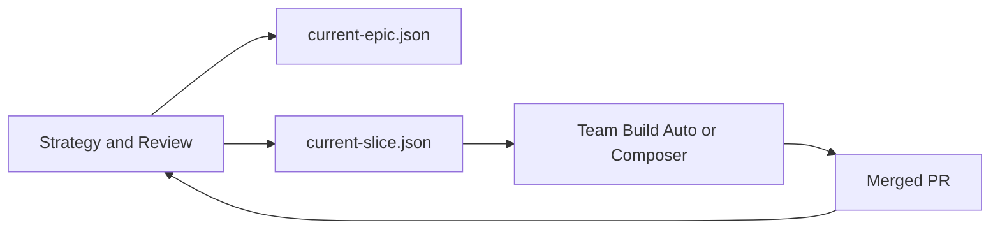

# Factory Vision — Two-Lane 24/7 BUILD

Compass → rails → execution. See [NORTH_STAR.md](../NORTH_STAR.md).

---

## Two lanes

| Trigger | Lane |
|---------|------|
| `good morning team` | Open workday only |
| Schedule 4h + `plan team` | Strategy |
| Schedule 60min | Team Build |
| `good evening team` | Brake |

---

## Cost intent

Majority of **runs** and **tokens** on Team Build (Auto/Composer). Strategy
runs ≤6× per open workday.

---

## Related

- [MODEL-ECONOMICS.md](./MODEL-ECONOMICS.md)
- [SLACK-FORMATS.md](./SLACK-FORMATS.md) (if present) or CEO T1/T2/T3 in automations
- [state/README.md](./state/README.md)
